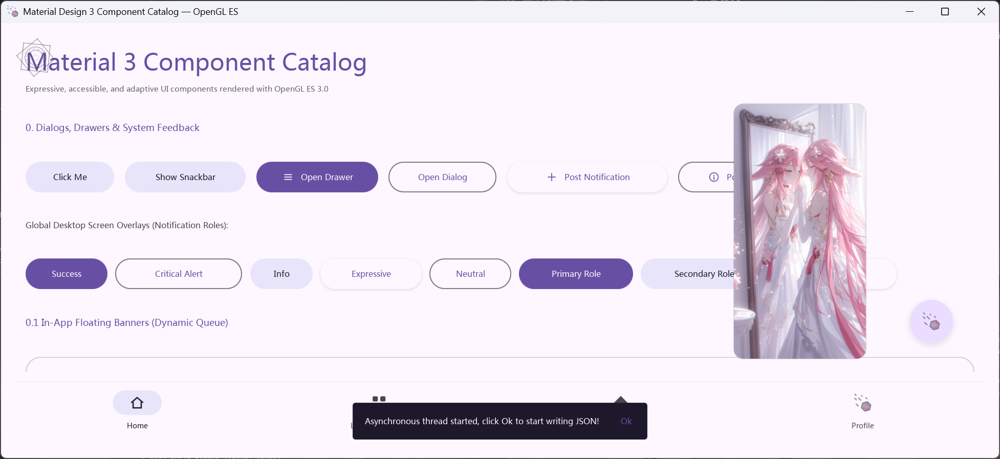

# Material 3 OpenGL ES C++ UI Library

[](https://en.cppreference.com/w/cpp/20)
[](https://www.khronos.org/opengles/)
[-blueviolet.svg?style=flat-square&logo=materialdesign)](https://m3.material.io/)
[]()
[](LICENSE)

A high-performance, lightweight, and hardware-accelerated **Material Design 3 (M3)** UI component framework written in modern C++17/20 and OpenGL ES 3.0+. 

Engineered for desktop applications, embedded systems, and custom rendering engines, this library features single-pass SDF (Signed Distance Field) anti-aliased geometry, second-order spring dynamics, multi-byte UTF-8 / Emoji handling, full touch/mouse ripple mechanics, and native desktop overlay integration.

## UI Showcase

<p align="center">
  
  <br/>
</p>

---

## 📑 Table of Contents

- [🖼️ UI Showcase](#-ui-showcase)
- [🏛️ Key Architecture Highlights](#️-key-architecture-highlights)
- [📦 Component Showcase](#-component-showcase)
  - [1. Actions & Inputs](#1-actions--inputs)
  - [2. Navigation & Containers](#2-navigation--containers)
  - [3. Feedback & Indicators](#3-feedback--indicators)
  - [4. Media, Data & Complex Pickers](#4-media-data--complex-pickers)
- [Directory Structure](#-directory-structure)
- [🛠️ Build & Installation](#️-build--installation)
  - [MSVC Build (Visual Studio)](#msvc-build-visual-studio)
  - [MinGW-w64 Build (GCC/Clang)](#mingw-w64-build-gccclang)
- [🚀 Quick Start (Minimal Activity Example)](#start-designing-your-first-awesome-ui)
- [📄 License & Credits](#-license--credits)

---

## Key Architecture Highlights

| Category | Features & Technical Specifications |
| :--- | :--- |
| **GPU Rendering Engine** | Single-pass GPU shader pipeline (`MaterialShader`), analytical Signed Distance Field (SDF) box/circle/capsule rendering, independent 4-corner rounded radii, soft Gaussian-approximated drop shadows, and scissor viewport clipping. |
| **Animation Kinetics** | Perlin C2-continuous Smootherstep ($6t^5 - 15t^4 + 10t^3$), Emphasized Decelerate cubic easing, and 2nd-order spring-damper physical integration ($F = -k x - c v$) for sliders, tabs, and clock hands. |
| **M3 Theming System** | Dynamic color token resolver with automatic Light/Dark palette extraction, surface tinting, state layer opacity mixing (`Hover: 8%`, `Focus: 12%`, `Pressed: 16%`), and runtime dynamic switching. |
| **Layout & Coordinate System** | Android-inspired declarative layout engine with `MATCH_PARENT`, `WRAP_CONTENT`, margin/padding insets, and subpixel density-independent pixel scaling (`dp(x)`). |
| **Unicode & Input Stack** | Comprehensive 1-to-4 byte UTF-8 / Emoji string decoding, bidirectional drag selection, smooth pulsing blinking carets, binary-search text truncation with ellipsis, and system clipboard integration (`Ctrl+A/C/X/V`). |
| **Native Multi-Window Hooks** | Support for in-app floating layers as well as native standalone desktop overlay windows (`WS_EX_TOOLWINDOW` / `WS_EX_TOPMOST` on Windows, `_NET_WM_TYPE_NOTIFICATION` on X11). |

---

## 📦 Component Showcase

### 1. Actions & Inputs
- **`MaterialButton` / `MaterialButtonBuilder`**: Filled, Outlined, Text, Tonal, and Elevated variants with state layers, leading/trailing icons, and radial ripple expansion.
- **`MaterialFAB`**: Floating Action Button in Standard (56dp), Extended (with label), and Mini (40dp) formats with dynamic elevation shifts.
- **`MaterialIconButton` & `MaterialIconButtonToggle`**: Compact circular click targets with halo projections and persistent toggle states.
- **`MaterialSegmentedButton`**: Single and multi-select segmented groups with physical spring animations and checkmark expansions.
- **`MaterialCheckbox`**: Tri-state (Checked, Unchecked, Indeterminate) with animated checkmarks and outline-to-fill morphing.
- **`RadioButton`**: Polar-interpolated selection dot and outer ring with ripple dynamics.
- **`MaterialSwitch`**: Standard M3 toggle switch with Emphasized Decelerate travel motion, resting icon pop-in expansion, and Sun/Moon dual-theme toggle mode.
- **`TextField` / `TextFieldBuilder`**: Outlined (with dynamic notch cutouts), Filled, and Underlined text inputs featuring Perlin Smootherstep floating labels, password masking, error states, and clear actions.

### 2. Navigation & Containers
- **`NavigationBar`**: Bottom destination navigation bar with sliding pill indicators and customizable vector tab icon delegates.
- **`NavigationDrawer`**: Modal side sheet with scrim backdrop, recursive hierarchical expandable groups (`DrawerExpandableGroup`), rotating chevron indicators, and kinetic scrolling.
- **`MaterialPrimaryTab`**: Main tab bar (`MaterialTabRow`) with smooth sliding indicator underline transitions.
- **`PageContainer`**: Viewport page manager supporting Android ViewPager-style `Slide` and Material 3 `FadeThrough` scrim cross-fades with hardware scissor clipping.
- **`MaterialCard`**: Rounded surface containers with custom corner radii, elevation shadows, and touch ripples.
- **`MaterialDialog`**: Centered modal dialogues with title, body, and action buttons over a dimmed background.
- **`MaterialDropdown`**: Anchor-aligned popup menu with auto viewport edge collision clamping and item hover layers.

### 3. Feedback & Indicators
- **`Snackbar`**: Asynchronous FIFO message queue with binary-search single-line truncation and interactive action button callbacks.
- **`NotificationOverlay`**: Stacked in-app toast notification queue with cubic-eased auto-reordering and timeout progression.
- **`MaterialLoading`**: Indeterminate circular spinners, continuous gradient rings, and pulsing orbit dot animations.
- **`MaterialSkeletonText` / `SkeletonText`**: Shimmering layout placeholder bars for smooth asynchronous loading transitions.

### 4. Media, Data & Complex Pickers
- **`MediaSlider`**: Interactive playback seekbar supporting dynamic animated sine waveforms (`Squiggly`), standard M3 tracks, thick touch capsules, and linear progress indicators.
- **`MaterialDatePicker`**: Full Gregorian calendar picker with leap-year logic, month pagination transitions, and date validation.
- **`TimePickerDial`**: Analog clock face with 2nd-order polar spring physics ($k=25$) alongside dual digital numeric card input modes.
- **`MaterialColorPicker`**: 2D HSV saturation-value canvas, circular hue dial, live RGB/Hex string sync, and color swatches.
- **`MaterialPieChart`**: Custom GLSL ES 3.0 polar-coordinate fragment shader, slice hover magnification, SDF grid rings, and tooltip bubbles.
- **`StarrySkyFormation` & `StarrySkyNotification`**: Dynamic multi-layer vector magic array (dual rotating octagons, energy pulses, 12 Greek runes) combined with a cross-platform desktop/in-app notification queue.

---

## Structure

```text
├── layout/
│   ├── View.hpp / View.cpp               # Base View lifecycle, event routing, and dp scaling
│   └── LinearLayout.hpp / LinearLayout.cpp # Linear box layout manager (Horizontal / Vertical)
├── theme/
│   └── MaterialTheme.hpp / .cpp            # M3 color tokens, hex parsers, and lerp utilities
├── shader/
│   ├── MaterialShader.hpp / .cpp         # GPU batch renderer, SDF pipeline, and FreeType text
│   ├── Icon.hpp / Icon.cpp               # Procedural M3 vector icons and asset paths
│   └── TextureLoader.hpp / .cpp          # Image and texture management via stb_image
├── components/
│   ├── MaterialButton.hpp / .cpp
│   ├── MaterialCard.hpp / .cpp
│   ├── MaterialCheckbox.hpp / .cpp
│   ├── MaterialColorPicker.hpp / .cpp
│   ├── MaterialDatePicker.hpp / .cpp
│   ├── MaterialDialog.hpp / .cpp
│   ├── MaterialDropdown.hpp / .cpp
│   ├── MaterialFAB.hpp / .cpp
│   ├── MaterialIconButton.hpp / .cpp
│   ├── MaterialLoading.hpp / .cpp
│   ├── MaterialPieChart.hpp / .cpp
│   ├── MaterialPrimaryTab.hpp / .cpp
│   ├── MaterialSearch.hpp / .cpp
│   ├── MaterialSegmentedButton.hpp / .cpp
│   ├── MaterialSwitch.hpp / .cpp
│   ├── MediaSlider.hpp / .cpp
│   ├── NavigationBar.hpp / .cpp
│   ├── NavigationDrawer.hpp / .cpp
│   ├── NotificationOverlay.hpp / .cpp
│   ├── PageContainer.hpp / .cpp
│   ├── RadioButton.hpp / .cpp
│   ├── SkeletonText.hpp / MaterialSkeletonText.cpp
│   ├── Snackbar.hpp / .cpp
│   ├── StarrySkyFormation.hpp / .cpp
│   ├── StarrySkyNotification.hpp / .cpp
│   ├── TextField.hpp / .cpp
│   ├── TextView.hpp / .cpp
│   └── TimePickerDial.hpp / .cpp
└── CMakeLists.txt
```

## 🛠️ Build Instructions
### The build system relies on standard CMake with in-tree vendored dependencies.

## MSVC Build (Visual Studio)
```bash
# Open "x64 Native Tools Command Prompt for VS"
cmake -B build
cmake --build build --config Release --parallel
./build/Release/Material_Design3_Edition
```

## MinGW-w64 Build (GCC/Clang)
```bash
# Ensure gcc, g++, and make/ninja are in your PATH
cmake -B build -G "MinGW Makefiles" -DCMAKE_BUILD_TYPE=Release
cmake --build build -j%NUMBER_OF_PROCESSORS%
./build/Material_Design3_Edition
```

---
## Start designing your first awesome UI
```cpp
/**
 * @file main.cpp
 * @brief Minimal runnable entry point demonstrating the Material 3 OpenGL ES UI Framework.
 * 
 * Sets up an Activity with a dual-axis centered Button that triggers an
 * interactive Material 3 Snackbar notification upon user interaction.
 * 
 * @author Vectorted
 * @repository https://github.com/Vectorted
 * @license Open-source
 * @copyright Copyright (c) 2026 Vectorted. All rights reserved.
 */
#include "content/Activity.hpp"
#include "components/MaterialComponents.hpp"
#include "event/ApplicationLooper.hpp"
#include "theme/MaterialTheme.hpp"

using namespace content;

/**
 * @class MainActivity
 * @brief Minimal application activity showcasing centered layout alignment and Snackbar integration.
 * 
 * Inherits from content::Activity to manage the lifecycle, configure window parameters,
 * load font typography assets, and construct the visual UI component tree.
 */
class MainActivity : public Activity {
private:
    Snackbar* snackbar = nullptr; /**< Global transient snackbar feedback layer. */

public:
    /**
     * @brief Configures initial window title and default viewport dimensions.
     */
    void onInit() override {
        setTitle("Material 3 OpenGL ES — Minimal Example");
        setSize(800, 600);
    }

    /**
     * @brief Performs pre-composition configuration such as font asset loading.
     * 
     * @param app Reference to the running ApplicationLooper runtime context.
     */
    void onCreate(ApplicationLooper& app) override {
        app.setConsoleVisible(false);
        app.setEnableDebugTitle(true);

        /* Load typeface asset for text and icon rasterization */
        app.getShader().loadFont("./resources/Edition.ttf");
    }

    /**
     * @brief Constructs and binds the minimal component hierarchy.
     * 
     * Creates a full-screen layout centered on both axes (Gravity::CENTER), adds a
     * Filled Button, and binds a click listener to trigger the Snackbar.
     * 
     * @param app Reference to the active ApplicationLooper.
     * @return View* Root ViewGroup containing the layout and overlay components.
     */
    View* compose(ApplicationLooper& app) override {
        /* 1. Root container holding both layout tree and top-level overlays */
        ViewGroup* root = new ViewGroup();
        root->setLayoutParams(MATCH_PARENT, MATCH_PARENT);

        /* 2. Initialize the transient Snackbar component */
        snackbar = new Snackbar();
        Snackbar* sb = snackbar;

        /* 3. Full-screen container centered on both horizontal and vertical axes */
        LinearLayout* centerContainer = new LinearLayout(LinearLayout::Orientation::VERTICAL);
        centerContainer->setLayoutParams(MATCH_PARENT, MATCH_PARENT);
        centerContainer->setGravity(Gravity::CENTER);

        /* 4. Construct a Material 3 Filled Button using the fluent builder API */
        Button* helloButton = Components::button()
            .filled()
            .text("Click Me")
            .textSize(16.0f)
            .padding(24.0f, 14.0f, 24.0f, 14.0f)
            .setOnClickListener([sb]() {
                sb->show("Hello Material3 OpenGL ES", "DISMISS", nullptr, 3.0f);
            })
            .build();

        /* 5. Assemble the visual tree */
        centerContainer->addView(helloButton);

        root->addView(centerContainer);
        root->addView(snackbar); // Added last to ensure overlay renders on top

        return root;
    }

    /**
     * @brief Handles window resize events.
     * 
     * @param app Reference to the running ApplicationLooper.
     * @param width New framebuffer width in pixels.
     * @param height New framebuffer height in pixels.
     */
    void onResize(ApplicationLooper& app, int width, int height) override {}

    /**
     * @brief Cleanup hook invoked when the activity lifecycle terminates.
     * 
     * @param app Reference to the terminating ApplicationLooper.
     */
    void onDestroy(ApplicationLooper& app) override {}
};

/* Register the main application entry */
MAIN_ACTIVITY(MainActivity)
```
---
## LICENSE
```text
MIT License

Copyright (c) 2026 Vectorted

Permission is hereby granted, free of charge, to any person obtaining a copy
of this software and associated documentation files (the "Software"), to deal
in the Software without restriction, including without limitation the rights
to use, copy, modify, merge, publish, distribute, sublicense, and/or sell
copies of the Software, and to permit persons to whom the Software is
furnished to do so, subject to the following conditions:

The above copyright notice and this permission notice shall be included in all
copies or substantial portions of the Software.

THE SOFTWARE IS PROVIDED "AS IS", WITHOUT WARRANTY OF ANY KIND, EXPRESS OR
IMPLIED, INCLUDING BUT NOT LIMITED TO THE WARRANTIES OF MERCHANTABILITY,
FITNESS FOR A PARTICULAR PURPOSE AND NONINFRINGEMENT. IN NO EVENT SHALL THE
AUTHORS OR COPYRIGHT HOLDERS BE LIABLE FOR ANY CLAIM, DAMAGES OR OTHER
LIABILITY, WHETHER IN AN ACTION OF CONTRACT, TORT OR OTHERWISE, ARISING FROM,
OUT OF OR IN CONNECTION WITH THE SOFTWARE OR THE USE OR OTHER DEALINGS IN THE
SOFTWARE.
```
